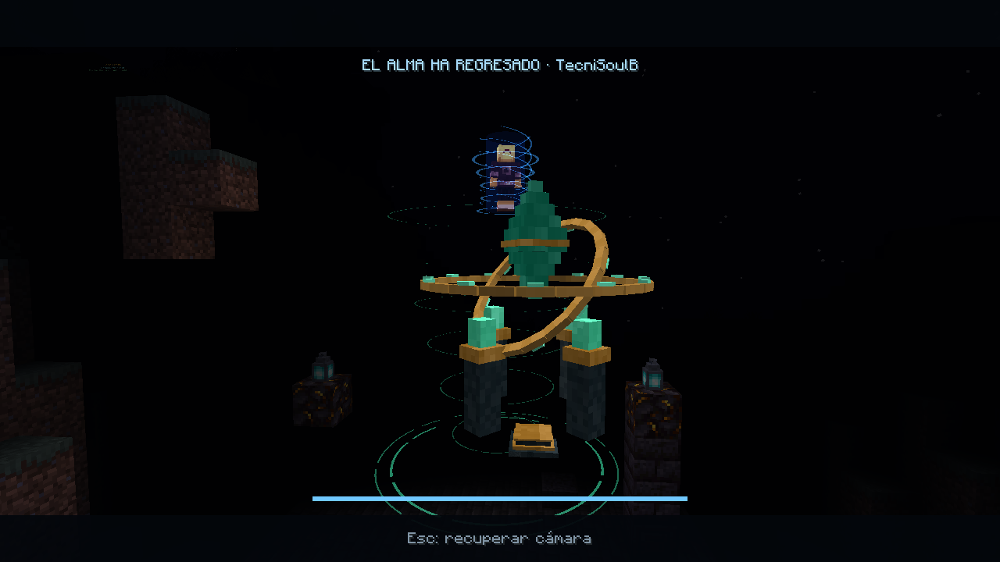

# TecniHardcore

Minecraft **1.20.1 Fabric** · paquete y launcher **2.7.0**.

## Descargar y jugar

Descarga [el instalador de la última versión publicada](https://github.com/Doumomentss/TecniHardcore/releases/latest), elige una carpeta y abre el launcher. Escribe tu nombre y pulsa **JUGAR AHORA**. En el menú, **ENTRAR AL SERVIDOR** conecta directamente. Una actualización solo se anuncia como disponible cuando aparece su Release.

El instalador contiene launcher, menú, modelos, texturas, sonido y mods propios. El primer inicio descarga 67 mods externos de sus URLs oficiales de Modrinth, con SHA-512 y SHA-256; obtiene Java 17, Fabric y Minecraft desde sus proveedores oficiales cuando hacen falta. Necesitas Internet y una cuenta/licencia de Minecraft conforme a las condiciones de Mojang. El launcher no entrega cuentas ni incluye credenciales.

Servidor público: `rails-acorn.tun.ply.gg:6906`. Primera conexión: `/register CONTRASEÑA CONTRASEÑA` (12–128 caracteres); siguientes: `/login CONTRASEÑA`.

## Actualizaciones

El launcher consulta GitHub al abrirse, cada hora y con **Ajustes → Buscar actualizaciones**. Cuando se publica una versión posterior aparece **ACTUALIZAR**. Cierra Minecraft, pulsa el botón y espera: descarga el instalador, comprueba tamaño y SHA-256, cierra el launcher, instala y vuelve a abrirlo. No necesita una cuenta de GitHub ni permisos de administrador si instalas en tu carpeta de usuario.

El 100 % de descarga no significa que la instalación haya terminado. Desde 2.4.1 se muestra una ventana de instalación, se espera a que se liberen los archivos y se verifica la copia antes de volver a abrir el launcher. No abras el acceso directo durante ese paso. Si una actualización anterior falló con `EPERM` o un `.pak` en uso, cierra todas las instancias del launcher, descarga el setup actual y elige exactamente la carpeta de instalación existente; conserva `game` y preferencias. Si falla, consulta `%TEMP%\tecnihardcore-install-error.txt`.

Los archivos de launcher reemplazados se guardan en `backups`. El instalador valida todo el paquete antes de aplicarlo, revierte fallos de reemplazo y recupera una operación interrumpida al ejecutarse nuevamente. `game`, mundos locales, Java descargado y preferencias se conservan. Los mods y configuraciones oficiales se sincronizan al siguiente inicio o al pulsar **Verificar y reparar paquete**; los archivos reemplazados también tienen copia. Sin Internet puedes abrir el launcher y usar una instalación preparada; la comprobación de actualización avisa si no responde.

Los launchers antiguos necesitan instalar **2.1.1 una vez** para obtener el actualizador. Las versiones futuras se anunciarán desde esta misma publicación. Publicar el código por sí solo no crea una actualización: hay que publicar una Release con su instalador y `update.json`.

## Santuarios de las Almas

Cinco vidas, dificultad difícil y resurrecciones ilimitadas. El único santuario del servidor está en la plaza del spawn, en **0, 96, 0**. Un superviviente ofrece un Corazón Sagrado, selecciona al eliminado cercano y canaliza 30 segundos. Cada ritual completo consume un corazón y devuelve una vida. Daño, distancia, desconexión o pérdida de la ofrenda cancelan sin coste.

El núcleo monumental 3D tiene cristal flotante, anillos animados, runas, fragmentos, iluminación emisiva y sonido posicional. Al activarse expande una cúpula negra de 32 bloques. A los diez segundos ambos participantes ven una toma desde la espalda del oficiante. La skin del revivido aparece sobre el cristal y desciende con una hélice azul hasta el suelo. `Esc` recupera la cámara sin cancelar el ritual. Los observadores conservan su cámara. También incluye Brasa, Bastión y Eco, enfriamiento compartido de tótems, indicador de vidas con cristales y video de muerte con audio.

Consulta [la guía de administración](ADMINISTRACION.md), [las pruebas de las mecánicas](RESULTADOS-2.1.md) y [las pruebas del actualizador](RESULTADOS-ACTUALIZADOR.md).

## Código y construcción

- `launcher/`: Electron, instalación, reparación, consulta de vidas y actualizador.
- `custom_mods/hardcore/`: lógica del servidor y cliente, modelos GeckoLib, animaciones, partículas y sonidos.
- `custom_mods/death-overlay/`: reproducción de la animación de muerte.
- `installer_payload/`: configuración y recursos oficiales; `mods-downloads.json` fija los 67 mods externos por URL y hashes.
- `installer/`: instalador Windows con verificación, copias y recuperación.
- `tools/`: construcción, publicación y pruebas.

Requisitos de desarrollo: Windows, Node.js 22 o posterior, Java **JDK 17**, Gradle 8.14 y Python 3.11 o posterior. En `launcher`, ejecuta `npm ci` y `npm test`. `node tools/fetch-development.cjs` descarga las dependencias de compilación fijadas por hash (GeckoLib, EasyAuth y tipos de API usados por la integración experimental). Los JAR de API no se instalan en Fabric ni se incluyen en el cliente. Compila el mod desde `custom_mods/hardcore` con `gradle build`; las pruebas Java se ejecutan durante el build.

## NPCs, equipos y mercado

Inés y Bruno ofrecen misiones iniciales que pagan **Cristales Tecni**. Selma permite publicar lotes, consultar vendedor/precio y comprar con entrega en un buzón persistente. `/team crear Nombre` crea un equipo; `/team` o `/chat` alterna entre mensajes generales y privados. No hay daño entre compañeros; una expulsión activa dos horas de protección mutua contadas mientras el expulsado está conectado y autenticado.

Incluye editor de diálogos y skins por URL para operadores, AntiXray, Fiw y límites de acciones TecniGuard. Grim se excluyó por incompatibilidad comprobada con objetos e inventarios del paquete; no hay sanciones automáticas por movimiento.

Consulta [comandos y administración](NPCS-EQUIPOS-MERCADO.md), [novedades](NOVEDADES-2.7.md) y [pruebas y límites](RESULTADOS-2.7.md).

Para generar un instalador desde el repositorio, después de `npm ci` ejecuta `node tools/prepare-payload.cjs`: obtiene los dos JAR propios de la Release fijada por hashes, recupera el video convertido y prepara el runtime de Electron instalado por npm. Si cambias el mod, copia el JAR compilado en `installer_payload/mods` antes de empaquetar. Los archivos generados de video `.fma` también pueden reconstruirse desde el WebM con `python tools/build-death-video.py` (requiere `pillow` e `imageio-ffmpeg`). Los assets 3D y audio editables ya están en `custom_mods/hardcore/src/main/resources`; `tools/build-sanctuary-assets.py` permite regenerarlos con `pillow`, `numpy` e `imageio-ffmpeg`.

`tools/package-launcher.ps1` construye `app.asar` con dependencias de producción. `tools/build-installer.py` toma la versión de `launcher/package.json`; `tools/create-release-manifest.py` genera hashes y el aviso. En el workspace del propietario, `tools/publish-release.ps1` reconstruye, verifica, exporta sólo archivos permitidos y publica la siguiente Release. Nunca añadas el workspace completo con `git add .`.

Los mods externos conservan sus licencias y créditos en `THIRD-PARTY-MODS.json`; se descargan de sus autores. No se publican mundo, bases de cuentas, secretos de Playit, credenciales, logs ni copias privadas del servidor. Este repositorio corresponde al cliente y código propio; no es una copia del servidor personal.

## Plaza y reliquias

El spawn tiene un único santuario de resurrección y una plaza protegida. Su tablón muestra las texturas de Brasa, Bastión y Eco; al pulsarlo puedes consultar efectos, penalizaciones y recetas. La pestaña Servidor del launcher muestra estadísticas y novedades reales, actualizadas cada cinco segundos. El Custodio de Pizarra solo aparece mediante invocación administrativa fuera de la plaza. Tiene tres barras (400/500/1000) y se transforma en el Espectro del Núcleo. No aparece de forma natural.

## Cataclismos y Bestias de Cristal

Cinco desastres activados por operadores: tornado monumental, terremoto, lluvia ácida, tormenta eléctrica y meteoritos. Causan daño real sin destruir terreno. Cada uno anuncia su inicio y conserva avisos visibles con partículas mínimas. La plaza está excluida.

El Custodio ofrece botín personal según participación y una tirada de cinco monturas cristalinas: mantarraya, ave, grifo, wyvern y dragón. Su registro por UUID evita duplicar criaturas mediante objetos copiados. Pueden intercambiarse guardadas, volar con controles configurables y llevar un jugador que utilice sus propias armas. Una montura muerta se pierde definitivamente.

La dimensión de eventos incluye Ojo de la tormenta, Circuito de cristal y Defensa del núcleo. El operador anuncia **ENSAYO** o **HARDCORE** antes de la inscripción. Ensayo guarda y restaura el estado original; hardcore utiliza vidas y objetos reales. Los biomas de Nature’s Spirit y Regions Unexplored aparecen en terreno nuevo; Handcrafted y Chipped aportan decoración. Consulta [comandos, reglas y recuperación](EVENTOS-Y-MONTURAS.md) y [el estado verificable de las pruebas 2.5](RESULTADOS-2.5.md).

Novedades y comandos actuales: [TecniHardcore 2.6](NOVEDADES-2.6.md). Pruebas y límites: [resultados 2.6](RESULTADOS-2.6.md).

Parche 2.6.1: tornado que sigue desniveles sin rechazar obstáculos, viento sin grabación de lluvia, meteoritos visibles con daño y cráteres 0–4, y terremoto con fracturas conectadas. [Comandos y niveles](NOVEDADES-2.6.1.md).
